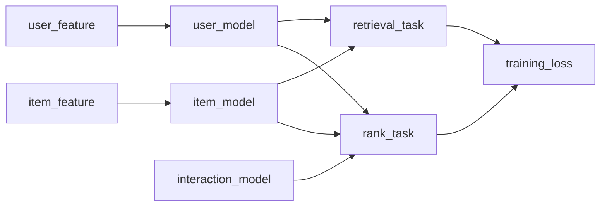

# model_tf2

tensorflow模型实现方式
* function api
* 继承tf.keras.model

继承model方式限制太多，使用function api进行封装

可能依赖的第三方库
deepctr

一些基础layer可以自己定义，可以用deepctr中的layer，包括
* linear
* dnn
* fm

* 模型训练
训练demo使用tensorflow_transform实现
  
# tower

# dcn   
dcn-v  原始dcn，交叉使用向量权重   
dcn-m  原始dcn，交叉使用矩阵权重   
dcn-mix  将交叉矩阵拆解成两个低秩矩阵
  
ps.
可以通过可视化矩阵权重，识别哪个特征交叉项是重要特征
